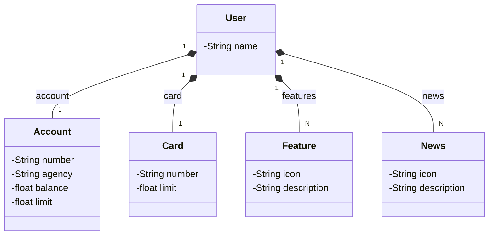

#Spring Cloud com Railway - DIO
Projeto do Curso API REST na Nuvem Usando Spring Boot 3, Java 21 e Railway

##Diagrama de classes

```mermaid
classDiagram
  class User {
    -String name
  }

  class Account {
    -String number
    -String agency
    -float balance
    -float limit
  }

  class Card {
    -String number
    -float limit
  }

  class Feature {
    -String icon
    -String description
  }

  class News {
    -String icon
    -String description
  }

  User "1" *-- "1" Account : account
  User "1" *-- "1" Card : card
  User "1" *-- "N" Feature : features
  User "1" *-- "N" News : news

```
